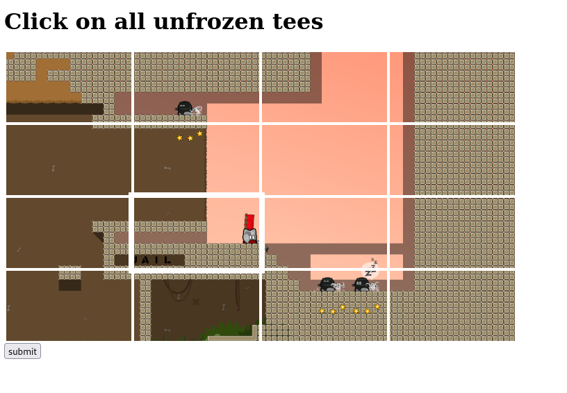

# tee-captcha

Teeworlds themed captcha to filter automated requests. No javascript has to be run on the client side.

Users can solve the captcha while having NoScript activated.



### sample using my instance

Ok let's be honest my instance is likley down since this project is me messing around.
But feel free to give it a try if you want to see the captcha in action without running your own.

```html
<iframe width="720px" height="600px" src="https://captcha.zillyhuhn.com/?t=your-token&callback=http://yourserver.tld" scrolling="no" frameborder="0"></iframe>
```

### setup your own instance

Run the backend (this repository)

```bash
npm install
node tee-captcha.js
```

The in your application that needs a captcha implement this iframe

```html
<iframe width="720px" height="600px" src="https://your-captcha-backend.tld/?t=your-token&callback=https://your-web-app.tld" scrolling="no" frameborder="0"></iframe>
```
